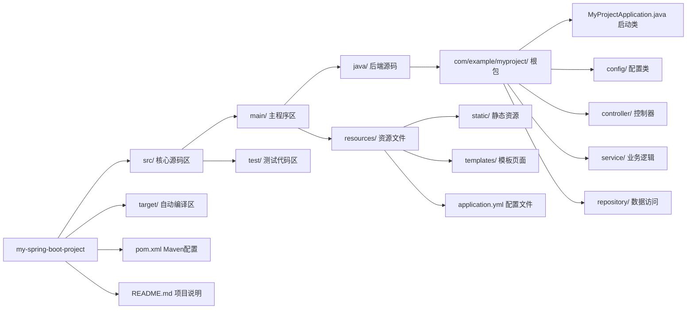
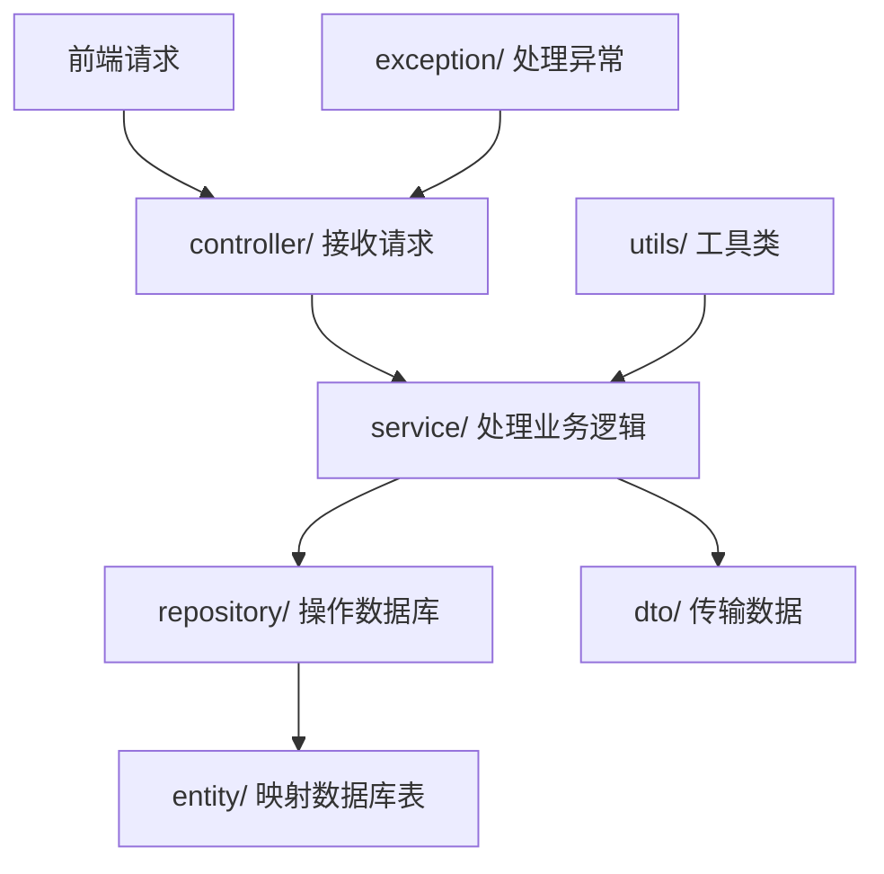
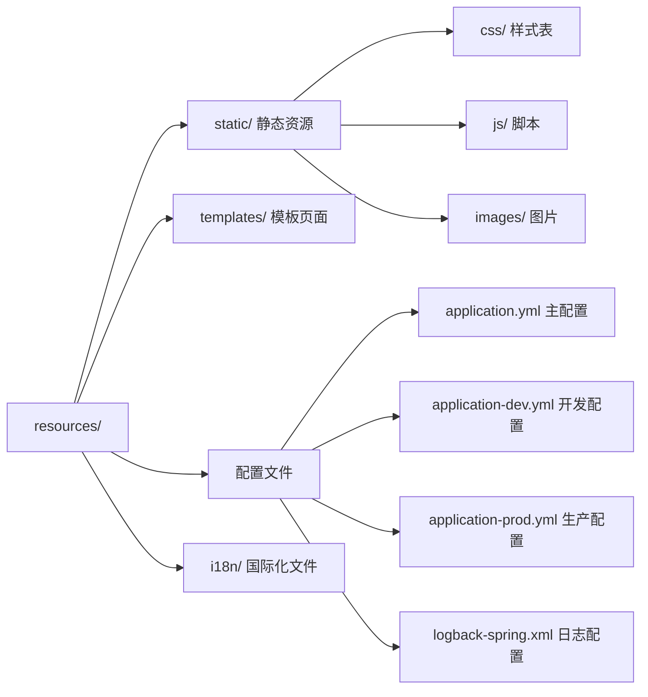

# 公众号文章

# 手把手带你吃透 Spring Boot 目录结构，新手也能少踩 80%的坑！

嗨，小伙伴！是不是刚创建完 Spring Boot 项目，看着满屏的文件夹和文件，瞬间有点懵圈？“这个 config 文件夹是干嘛的？代码放错地方会怎么样？”别慌！其实 Spring Boot 的目录结构就像咱们家里的收纳柜——每个格子都有固定用途，只要摸清规律，不仅找东西快，还能避免“东西乱塞导致找不到”的尴尬。今天咱们就从“看整体 → 拆细节 → 避大坑”一步步来，再配上直观的图表，保证你看完就能上手用！

## 第一步：先看“全家福”——30 秒摸清目录大框架

咱们先从最核心的目录结构说起，就像看房子先看户型图一样，先知道每个“功能区”在哪。用一张图帮你理清（建议对照自己的项目看，印象更深刻）：

```
my-spring-boot-project/
├── src/
│   ├── main/
│   │   ├── java/
│   │   │   └── com/
│   │   │       └── example/
│   │   │           └── myproject/
│   │   │               ├── MyProjectApplication.java      # 主启动类
│   │   │               ├── config/                        # 配置类目录
│   │   │               ├── controller/                    # 控制器目录
│   │   │               ├── service/                       # 服务层目录
│   │   │               │   ├── UserService.java
│   │   │               │   └── impl/
│   │   │               ├── repository/                    # 数据访问层目录
│   │   │               ├── entity/                        # 实体类目录
│   │   │               ├── dto/                           # 数据传输对象目录
│   │   │               │   └── request/
│   │   │               ├── exception/                     # 异常处理目录
│   │   │               └── utils/                         # 工具类目录
│   │   └── resources/
│   │       ├── static/                                    # 静态资源目录
│   │       │   ├── css/
│   │       │   │   └── style.css
│   │       │   ├── js/
│   │       │   │   └── app.js
│   │       │   └── images/
│   │       │       └── logo.png
│   │       ├── templates/                                 # 模板文件目录（Thymeleaf等）
│   │       │   ├── index.html
│   │       │   └── user/
│   │       │       └── profile.html
│   │       ├── application.yml                            # 主配置文件
│   │       ├── application-dev.yml                        # 开发环境配置
│   │       ├── application-prod.yml                       # 生产环境配置
│   │       ├── logback-spring.xml                         # 日志配置文件
│   │       ├── data.sql                                   # 初始化数据脚本
│   │       └── schema.sql                                 # 数据库结构脚本
│   └── test/
│       ├── java/
│       │   └── com/
│       │       └── example/
│       │           └── myproject/
│       │               ├── MyProjectApplicationTests.java # 主测试类
│       │               ├── controller/                    # 控制器测试
│       │               ├── service/                       # 服务层测试
│       │               └── repository/                    # 数据访问层测试
│       └── resources/
│           ├── application-test.yml                       # 测试环境配置
│           └── test-data.sql                              # 测试数据脚本
├── target/                                                # 编译输出目录（Maven）
├── pom.xml                                                # Maven 项目配置文件
├── .gitignore                                             # Git 忽略文件
├── README.md                                              # 项目说明文档
├── Dockerfile                                             # Docker 配置文件
├── docker-compose.yml                                     # Docker Compose 配置
└── docs/                                                  # 项目文档目录
    ├── api.md
    └── deployment.md
```





这张图里，**src/main** 是咱们日常开发的“主战场”，其他目录比如 target 是编译后自动生成的（不用手动改），pom.xml 是管理依赖的（比如引入 Spring Web、MySQL 驱动）。

这里先跟你说个新手常踩的坑：有小伙伴把 Java 代码（比如 UserController.java）放到了 resources 目录下，结果启动项目后接口全报 404！为啥呢？因为 Spring Boot 有个“潜规则”——**java 目录只认 .java 源码，resources 目录只认配置、图片这些非源码文件**，放错了就像把衣服塞到冰箱里，根本“用不了”～

## 第二步：拆“主战场”——每个文件夹该放啥，讲得明明白白

搞懂了整体框架，咱们再深入 src/main 这个“主战场”，逐个拆解每个子目录的用途，还会穿插“正确做法”和“避坑指南”，保证你看完不迷糊。

### 1. src/main/java：后端代码的“专属收纳柜”

这个目录下的文件就像家里的“衣柜、书柜、鞋柜”，每个子包都有明确分工，咱们一个个说：

#### （1）主启动类：项目的“大门钥匙”

位置在 `com/example/myproject/MyProjectApplication.java`，是整个项目的入口——就像你家的大门，只有用这把“钥匙”（main 方法）才能开门（启动项目）。它长这样：

```java
@SpringBootApplication
public class MyProjectApplication {
    public static void main(String[] args) {
        SpringApplication.run(MyProjectApplication.class, args);
    }
}
```

**避坑指南**：千万别把启动类放到 controller、service 这些子包下！之前有个小伙伴觉得“包结构乱，把启动类挪到 controller 里”，结果启动后报错“找不到 Service Bean”。因为 Spring Boot 默认只扫描**启动类所在包及其子包**的注解（@Service、@Repository 等），放到子包下，其他包的类就像“不在同一个房子里”，根本扫不到～

#### （2）功能子包：各司其职不混乱

接下来是 config、controller、service 这些子包，咱们用一张图看它们的协作关系：




- **controller/**：接收前端请求的“前台”，比如用 `@GetMapping("/user")` 接收查询用户的请求，然后把活儿交给 service 处理；
- **service/**：处理业务逻辑的“后台”，比如判断用户是否存在、计算订单金额，还分“接口（UserService.java）”和“实现类（impl/UserServiceImpl.java）”，解耦又好维护；
- **repository/**：跟数据库打交道的“仓库管理员”，比如用 JPA 或 MyBatis 查询数据，不用自己写复杂的 SQL；
- **entity/**：数据库表的“双胞胎”，比如 User 类对应 user 表，每个字段都和表字段一一对应（用 @Entity、@Id 注解标识）；
- **dto/**：数据传输的“快递盒”，比如前端传参用 CreateUserRequest，后端返回用 UserDto——千万别直接用 entity 传数据！之前有小伙伴把 entity 暴露给前端，结果前端不小心改了数据库主键（id），直接导致数据混乱，用 dto 就能避免这种问题；
- **config/**：项目的“设置面板”，比如配置跨域、Redis 连接、拦截器，用 @Configuration 注解标识，统一管理更清晰；
- **exception/**：处理异常的“急救箱”，比如自定义 CustomException，再用 @ControllerAdvice 写个全局异常处理器，避免报错信息直接暴露给前端；
- **utils/**：通用工具的“工具箱”，比如日期格式化（DateUtils）、字符串处理（StringUtils），静态方法调用，不用重复写代码。

### 2. src/main/resources：资源文件的“储物间”

这个目录放的是配置、静态资源这些“非代码类文件”，同样有讲究，放错位置就会“找不到东西”。

咱们先看它的结构：




- **static/**：放 CSS、JS、图片这些“静态资源”，前端能直接访问，比如 logo.png 放在 static/images/ 下，访问路径就是 http://localhost:8080/images/logo.png；
  **避坑指南**：别把静态资源放到 templates 目录！之前有小伙伴把 JS 文件丢到 templates 里，结果前端访问时全报 404——templates 是给 Thymeleaf、FreeMarker 这些模板引擎用的，专门放动态页面（比如 index.html），静态资源必须放 static 里；
- **templates/**：如果做前后端不分离的项目（比如用 Thymeleaf），动态页面就放这里，比如 index.html 里用 `<th:text="${username}">` 显示用户名，服务器渲染后再返回给前端；如果是前后端分离（用 Vue、React），这个目录可以删掉，静态资源全由前端管理；
- **配置文件**：项目的“总开关”，application.yml 是主配置，配置端口（server.port=8080）、数据库连接这些核心信息；application-dev.yml（开发环境）、application-prod.yml（生产环境）是不同环境的配置，用 `spring.profiles.active=dev` 就能切换，不用每次改配置都改主文件；
  **避坑指南**：别自定义配置文件名！有小伙伴把 application.yml 改成 app.yml，结果启动后配置全不生效——Spring Boot 默认只认“application”开头的配置文件，改了名就得在启动参数里指定（比如 --spring.config.name=app），麻烦又容易错；
- **i18n/**：放多语言文件的“翻译册”，比如 messages_zh_CN.properties（中文）、messages_en.properties（英文），实现项目的多语言切换，前端用 `#{message.key}` 就能调用。

## 第三步：实战避坑——这些“小细节”决定成败

掌握了基础结构，咱们再说说实战中的“最佳实践”，帮你少踩坑、写出更规范的代码。

### 1. 包命名：按“规矩”来，团队协作不迷路

包名要用“反向域名”格式，比如公司项目用 `com.baidu.cloud.shop`，个人项目用 `com.yourname.blog`，避免和别人的项目重名；小项目按“功能分层”（controller、service 这种），大项目按“业务模块”（比如 shop 项目分 user、order、product 模块，每个模块下再放 controller、service），找代码更高效。

### 2. 测试目录：跟主目录“保持一致”

src/test/java 的结构要和 src/main/java 完全对应，比如测试 UserController，就创建 `test/com/example/myproject/controller/UserControllerTest.java`，用 `@WebMvcTest(UserController.class)` 做测试。别随便放测试类！之前有小伙伴把测试类直接丢在 test 根目录，结果注入不了 Controller 依赖，就是因为包路径不对应，Spring Test 扫不到。

### 3. 敏感信息：别“明文”写，安全第一

配置文件里的数据库密码、API 密钥这些敏感信息，千万别明文写！比如别直接写 `spring.datasource.password=123456`，代码提交到 Git 会有泄露风险。正确做法是用环境变量（比如 `${DB_PASSWORD}`），或者用 Nacos 这种配置中心存储，部署时再动态注入，安全又灵活。

## 最后：总结一下，收获满满走一波

看到这里，是不是觉得 Spring Boot 目录结构没那么难了？其实核心就是“约定大于配置”——每个目录都有固定用途，按规矩放文件，不仅能避免 80% 的基础错误，还能让代码更易维护、团队协作更顺畅。

再跟你划几个重点：

1. 启动类必须在根包下，否则扫不到 Bean；
2. java 目录放源码，resources 目录放资源，别混着放；
3. 业务代码按“controller→service→repository”分层，解耦又好维护；
4. 配置文件别改名，敏感信息别明文，测试目录跟主目录对应。

现在就打开你的 Spring Boot 项目，对照本文梳理一下目录结构吧！如果遇到“配置不生效”“Bean 找不到”的问题，回头看看这篇文章，大概率能找到解决办法～要是还有其他疑问，比如大型项目怎么设计目录，或者某个具体目录的用法，随时来问我哦！
